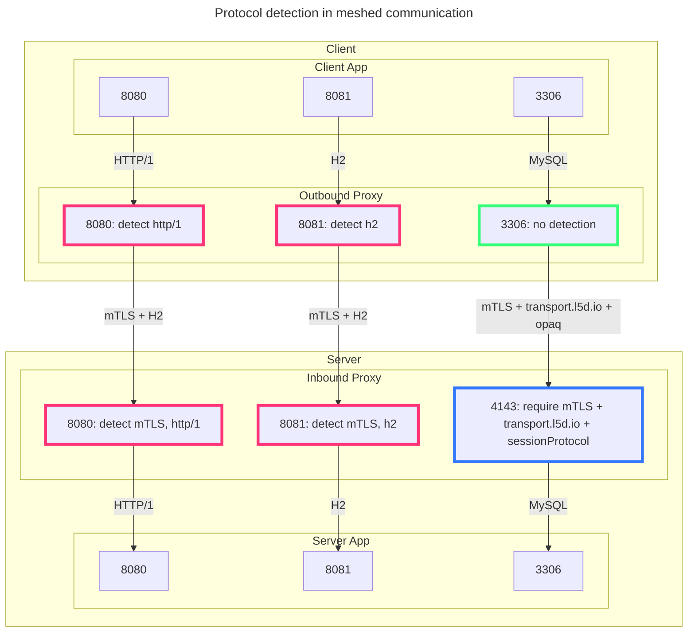
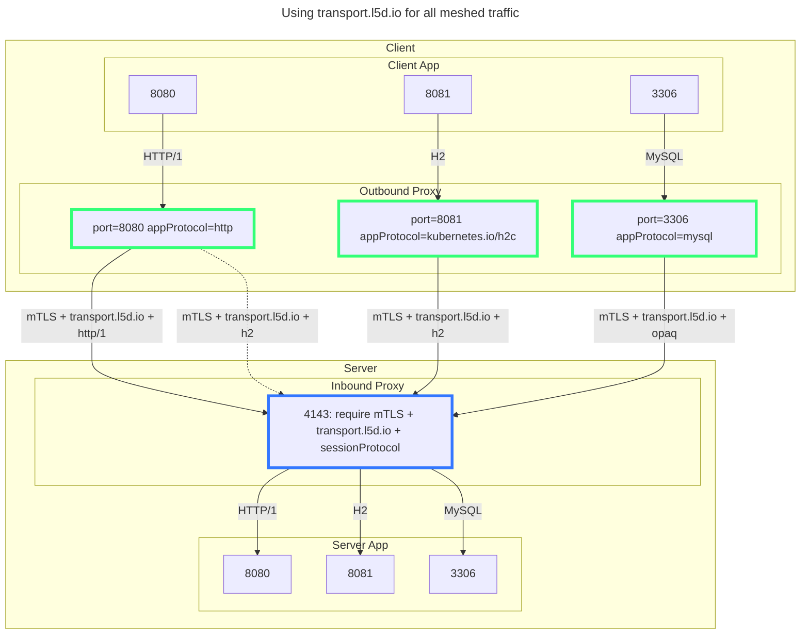

Linkerd dynamically infers the session protocol in use when handling TCP
connections to determine whether is HTTP/1 or H2. This discovery is performed in
several places:

- On outbound proxies calling a service or remote server.
- On inbound proxies receiving traffic from a remote client.
  - ... to detect mTLS.
  - ... to detect the HTTP variant.

Even when a *proxyProtocol* is configured on a Server resource, inbound proxies
must do dynamic protocol detection, since client proxies may multiplex HTTP/1
requests over H2 connections (transparently, on the same port as the
application’s traffic).

When you're getting started with Linkerd, this protocol detection is an
important way to get as much visibility into your traffic as possible. But as
you get into more advanced use cases, especially when configuring traffic
policies, it's more important for protocol handling to be predictable. And if
you're going through the bother of configuring policies, you probably don't
mind telling us a little about the application protocol!

## What’s Changing in BEL 2.18?

We've made it possible to elimiante protocol detection from most meshed
communication and we've introduced metrics that make it possible to the audit
usage of protocol detection in the data plane.

- Outbound proxies can use a Service’s [*appProtocol*](https://kubernetes.io/docs/concepts/services-networking/service/#application-protocol)
to bypass protocol detection when calling a Service.
  - <https://github.com/linkerd/linkerd2/pull/13721>: use `appProtocol` to
  configure http and h2c policies
- Outbound proxies will no longer send meshed traffic on the original
application port. Instead, proxies send traffic directly to the peer proxy’s
*inbound port* (4143). This connection uses additional protocol negotiation so
that inbound proxies do not need to perform dynamic protocol detection.
  - <https://github.com/linkerd/linkerd2/pull/13715>: default to using
  transport.l5d.io for all meshed application traffic
- New metrics have been added to proxies to report:
  - <https://github.com/linkerd/linkerd2-proxy/pull/3722>:
  `inbound_tcp_detect_http_results` and `outbound_tcp_detect_http_results` counters
  - <https://github.com/linkerd/linkerd2-proxy/pull/3723>:
  `inbound_tcp_transport_header_connections` counter
- Other small fixes:
  - <https://github.com/linkerd/linkerd2-proxy/pull/3721>: do not try to route
  closed sockets as opaque
  - <https://github.com/linkerd/linkerd2-proxy/pull/3724>: error message improvements

## What’s Next?

Detection may still be performed when using headless services (i.e., direct
pod-to-pod communication that does not target a ClusterIP Service). We plan on
adding an appProtocol to Linkerd's Server resource (replacing the proxyProtocol field).

Furthermore, additional changes are planned to remove detection when handling
traffic from outside the mesh.
